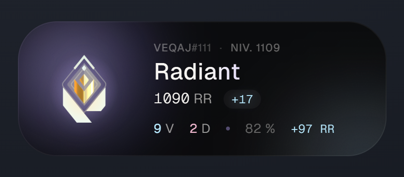
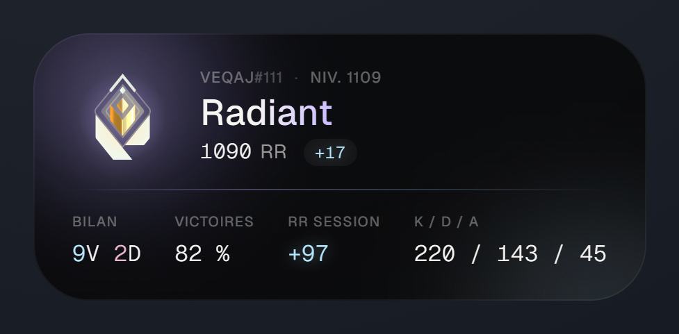
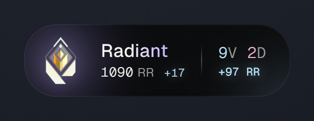
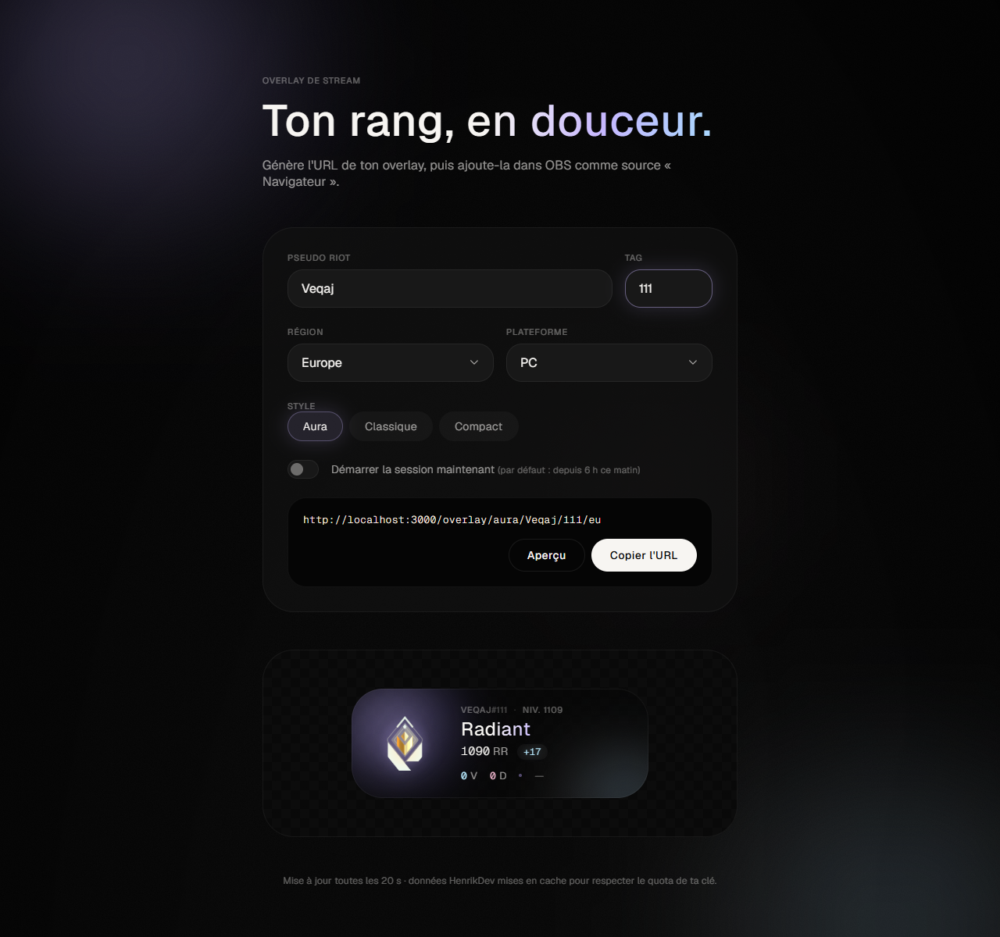

# Valorant Rank Tracker — overlays de stream

Overlays OBS qui affichent ton rang Valorant, tes RR et le bilan de ta session (victoires, défaites, nuls, RR gagnés),
mis à jour en direct toutes les 20 secondes **sans dépasser le quota d'une clé HenrikDev basique** (30 requêtes/min).

> Version retravaillée à partir de [mkornela/valorant-rank-tracker](https://github.com/mkornela/valorant-rank-tracker).

## Overlays disponibles

| Style | Contenu | Taille conseillée dans OBS |
|-------|---------|----------------------------|
| `aura` | Rang, RR, niveau, variation du dernier match, bilan de session, RR de la session (DA « Biomorphic Glow ») | 520 × 200 |
| `clean` | Carte détaillée : rang, RR, niveau, variation, puis tuiles Bilan, Victoires, RR session et K/D/A | 520 × 240 |
| `compact` | Version une ligne d'Aura : rang, RR, variation, bilan V/D/N et RR de la session | 420 × 110 |

### Aperçu

Exemples avec de vraies données (`Veqaj#111`, EU, session sur les 2 derniers jours). Le fond sombre est ajouté pour
la capture : dans OBS, l'overlay est transparent autour de la carte.

**Aura**



**Classique** (`clean`)



**Compact**



**Page d'accueil** : générateur d'URL avec aperçu en direct



## Installation

Prérequis : [Node.js](https://nodejs.org/) 20 ou plus récent.

```bash
npm install
cp .env.example .env
```

Ouvre `.env` et colle ta clé HenrikDev :

```env
HENRIKDEV_API_KEY=HDEV-xxxxxxxx-xxxx-xxxx-xxxx-xxxxxxxxxxxx
```

Pour obtenir une clé : [tableau de bord HenrikDev](https://api.henrikdev.xyz/dashboard/) → « API Keys », ou le salon `#get-a-key` du Discord HenrikDev (clé « VALORANT (Basic Key) »).

## Utilisation

```bash
npm start
```

Ouvre ensuite <http://localhost:3000> : la page d'accueil génère l'URL de ton overlay (pseudo, tag, région, plateforme, style)
et en affiche un aperçu. Dans OBS : **Sources → + → Navigateur**, colle l'URL et règle la taille.

### Format des URL

```
/overlay/{style}/{pseudo}/{tag}/{région}
```

Paramètres optionnels :

- `?since=HORODATAGE_MS` : compte la session à partir de cet instant (le bouton « Démarrer la session maintenant » de l'accueil le remplit pour toi).
- `?platform=console` : joueurs console (par défaut `pc`).

Régions : `eu`, `na`, `ap`, `kr`, `latam`, `br`.

Sans `since`, la session commence chaque jour à **6 h (heure locale)** : un stream qui dépasse minuit n'est pas coupé en deux.
L'heure locale est celle de la machine qui fait tourner le serveur. Sur un serveur distant, définis le fuseau avec la variable
d'environnement `TZ` (par exemple `TZ=Europe/Paris`).

Le bilan porte sur les 40 dernières parties classées, et le RR de session sur les 20 dernières parties classées (limite de l'API).

## Configuration (`.env`)

| Variable | Défaut | Rôle |
|----------|--------|------|
| `HENRIKDEV_API_KEY` | — | Clé API (obligatoire) |
| `PORT` | `3000` | Port du serveur |
| `REFRESH_SECONDS` | `20` | Fréquence de mise à jour des overlays (5 à 600 s) |
| `SESSION_RESET_HOUR` | `6` | Heure locale de début de session (0 à 23) |
| `NODE_ENV` | — | `development` affiche le détail technique des erreurs dans l'overlay |

## Comment le quota est respecté

Depuis la v4 de l'API, **chaque requête faite en arrière-plan vers Riot compte aussi dans le quota**.
Une seule requête `matches?size=10` peut donc coûter jusqu'à 11 crédits. L'ancienne version en faisait 3 par
rafraîchissement, ce qui épuisait le quota et cassait les overlays (erreurs 429).

Cette version :

1. **Interroge seulement 2 endpoints légers** :
   - `GET /valorant/v2/mmr-history/{région}/{plateforme}/{pseudo}/{tag}` : rang, RR, variation, RR de la session ;
   - `GET /valorant/v1/stored-matches/{région}/{pseudo}/{tag}?mode=competitive&size=40` : victoires/défaites/nuls, K/D/A, carte, niveau.
2. **Met en cache côté serveur.** Les overlays interrogent ton serveur toutes les 20 s, gratuitement. Le serveur ne rappelle
   HenrikDev qu'après au moins 20 s, et attend l'expiration du cache HenrikDev (en-tête `X-Cache-TTL`, ~5 min pour le MMR)
   avant de redemander une donnée qui serait de toute façon identique. Plusieurs overlays du même joueur partagent le même cache.
3. **Suit le quota** via les en-têtes `X-RateLimit-Remaining` / `X-RateLimit-Reset`, garde une réserve de 3 requêtes
   et se met en pause après un 429.
4. **N'affiche jamais un overlay vide.** En cas d'erreur ou de quota atteint, la dernière valeur connue reste à l'écran (légèrement atténuée),
   et la mise à jour se fait sur place, sans recharger la page.

En pratique, un joueur suivi coûte environ **2 à 6 requêtes par minute**. L'état du quota est visible sur `/api/quota`.

> Le MMR est mis en cache ~5 min par HenrikDev sur une clé basique : le rang et les RR peuvent donc mettre quelques
> minutes à apparaître après une partie. Le bilan V/D, lui, est rafraîchi toutes les 20 s.

## API locale

`GET /api/stats/{style}/{pseudo}/{tag}/{région}` renvoie les données utilisées par les overlays :

```json
{ "success": true, "data": { "player": {}, "rank": {}, "session": {}, "stale": false, "updatedAt": "…" }, "error": null }
```

## Développement

```bash
npm run dev            # redémarre à chaque modification
npm test               # tests (node:test)
npm run test:coverage  # couverture, seuil 80 %
```

```
index.js                 démarrage
src/
  config.js              constantes et variables d'environnement
  validation.js          validation des paramètres d'URL
  cache.js               cache TTL + repli sur la dernière valeur
  app.js                 application Express
  routes/overlays.js     pages d'overlay et API JSON
  henrik/                client HenrikDev, suivi du quota, erreurs
  stats/                 rangs (FR), calculs de session, assemblage des stats
public/js/fields.js      formatage partagé serveur ↔ navigateur
public/js/overlay.js     mise à jour en direct des overlays
views/overlays/          un template par style
```

## Avertissement

Outil non officiel, sans lien avec Riot Games. Données fournies par l'[API HenrikDev](https://docs.henrikdev.xyz/).
